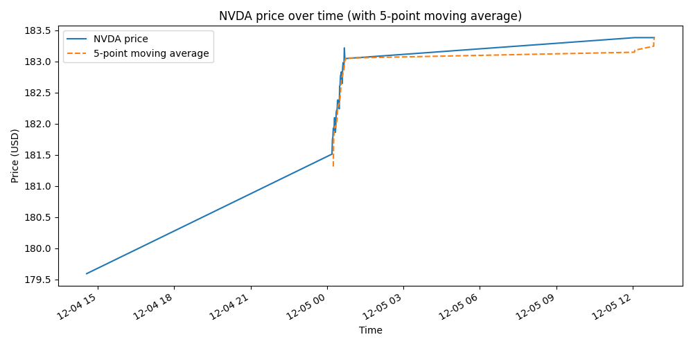

# NVDA Stock Tracker & Visualization (Python + yfinance + pandas)

This project demonstrates real-time stock price retrieval, automated intraday logging, and data visualization using Python. NVIDIA (NVDA) is used as an example stock, but the script can be adapted for any ticker.

The project includes:
- A real-time quote fetcher (`nvda_quote.py`)
- An automated logger that records NVDA prices to CSV (`nvda_logger.py`)
- A visualization script that plots price movements (`nvda_plot.py`)
- A sample output chart (`nvda_plot.png`)

---

## 📌 Features Overview

### 1️⃣ Real-Time Stock Quote  
**File:** `nvda_quote.py`  
Fetches the latest NVDA stock price using the `yfinance` library and prints:

- Symbol  
- Last traded price  
- Exchange  
- Timestamp  

---

### 2️⃣ Automated Price Logger  
**File:** `nvda_logger.py`  
This script automatically logs NVDA prices into a CSV file (`nvda_log.csv`) every 60 seconds.

Each row includes:
| time | price |
|------|--------|
| 2025-12-04T14:00:15 | 179.50 |
| 2025-12-04T14:01:15 | 179.60 |

Useful for intraday analysis, testing algorithms, or building time-series datasets.

---

### 3️⃣ Data Visualization  
**File:** `nvda_plot.py`  

This script:
- Loads `nvda_log.csv`
- Parses timestamps into datetime format
- Plots NVDA price trends with Matplotlib
- Supports adding moving averages (MA5, MA20)

---

## 📊 Example Chart

Below is a sample output generated from real logged data:



---

## 📦 Installation

Make sure Python 3.10+ is installed.

Install dependencies:

```bash
pip install yfinance pandas matplotlib

## ▶️ How to Run the Scripts

### 1. Get the latest NVDA quote
```bash
python nvda_quote.py
```

### 2. Start automatic logging
```bash
python nvda_logger.py
```

### 3. Generate the visualization
```bash
python nvda_plot.py
```
---

## 📂 Project Structure

```
nvda-stock-tracker/
│
├── nvda_quote.py          # Fetch latest NVDA price
├── nvda_logger.py         # Log price every minute into CSV
├── nvda_plot.py           # Plot data as a time-series chart
├── nvda_plot.png          # Example visualization image
└── nvda_log_sample.csv    # (Optional) A small sample of logged data
```
---
##  What I Learned

- How to retrieve stock market data using the `yfinance` API  
- How to build automated logging scripts and handle CSV writing  
- Working with time-series data in `pandas`  
- Creating visualizations using `matplotlib`  
- Understanding file locking issues and CSV header handling  
- Structuring a clean and professional GitHub project  
- Improving Python automation and data analysis workflow design  

---
##  Possible Future Improvements

- Add support for multiple tickers instead of only NVDA  
- Calculate technical indicators (MA, EMA, RSI, MACD)  
- Build a dashboard using Streamlit or Flask  
- Implement alerts: send LINE/Email notifications when price moves  
- Replace CSV storage with SQL database (SQLite / PostgreSQL / Oracle)  
- Add scheduler so the logger runs automatically during US market hours  
- Deploy visualization as a small web app  


